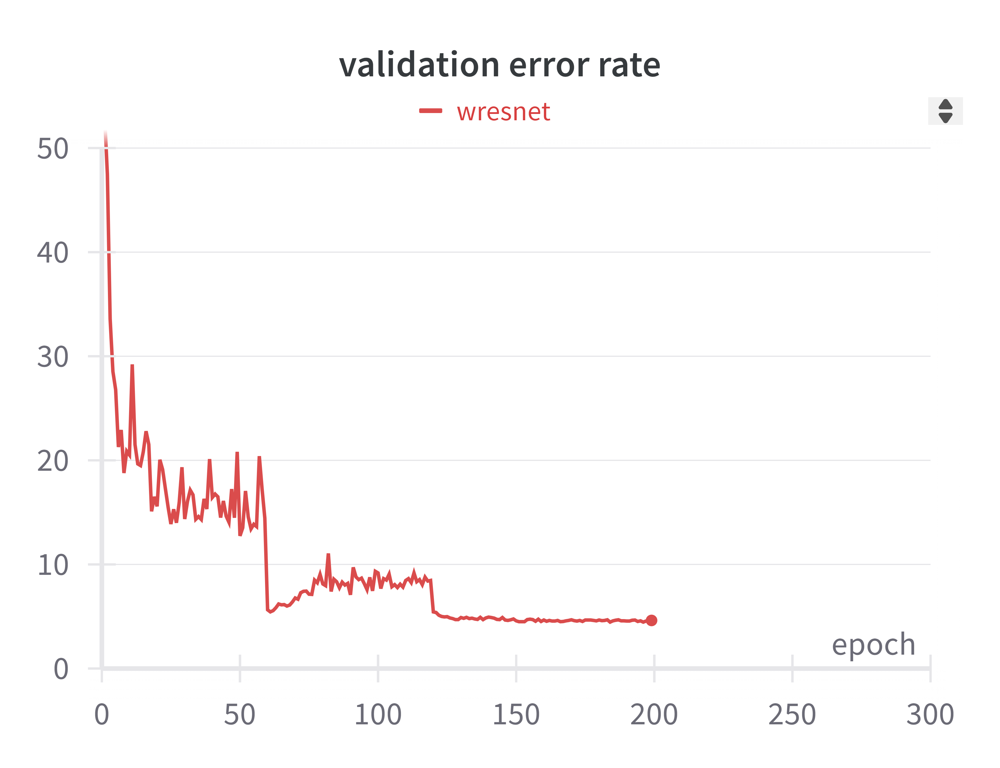

# cifar10_resnext
간단한 이미지 분류 모델입니다.

### Introduction

[Aggregated Residual Transformations for Deep Neural Networks](https://arxiv.org/pdf/1611.05431) 논문을 읽고 resnext model을 직접 구현해보았습니다.
학습 데이터셋은 cifar10을 사용했습니다.


### Requirements
After cloning the repo, run this line below:
```
pip install -r requirements.txt
```

### Usage

##### 1. train & test model
```
mkdir model
python -m cifar10_resnext.train -model {모델}
python -m cifar10_resnext.test -model {모델}
```

##### 2. statistics (To Be Revised)
| model              | # layers | # params | error(%) |
|--------------------|:---------|----------|----------|
| Wide ResNet(28-10) | 29       | 36.5M    | tbd      |
| ResNeXt29(8x64d)   | 29       | 34.4M    | tbd      |
| ResNeXt29(16x64d)  | 29       | 68.1M    | tbd      |


##### 3. plots (To Be Revised)
- testing error(wresnet & resnext29(8x64d) & resnext29(16x64d))


- testing error(wresnet)



- testing error(resnext29(8x64d))


- testing error(resnext29(16x64d))


